# sodo-platform

**IBAC（Interface-Based Access Control，基于接口的权限控制）微服务快速开发平台。**

    由于原仓库错误的合并操作，故清空后重新提交了代码。

## 平台架构

    sodo-platform
    ├─doc 					            // 文档
    ├─sodo-auth 			            // 统一认证服务
    ├─sodo-catkin 				        // 分布式 ID 服务（整合自 TinyId）
    ├─sodo-common 					    // 公共总包
    │  ├─sodo-catkin-starter 		    // 分布式 ID 客户端
    │  ├─sodo-common-base 			    // 公共基础包
    │  ├─sodo-common-core 		        // 公共核心包
    │  ├─sodo-common-starter 	        // 公共客户端
    │  ├─sodo-knife4j-starter 	        // Swagger2 接口文档客户端
    │  ├─sodo-log-starter 		        // 分布式日志客户端
    │  ├─sodo-mybatis-starter 	        // Mybatis-plus 客户端
    │  ├─sodo-openfeign-starter         // Openfeign 客户端
    │  ├─sodo-rabbitmq-starter 		    // RabbitMq 客户端
    │  └─sodo-redis-starter 	        // Redis 客户端
    ├─sodo-eureka 					    // 注册中心服务
    ├─sodo-goods 				    	// 业务模块-商品服务（待开发）
    ├─sodo-housekeeper 			    	// 管家服务
    ├─sodo-log 			                // 日志服务
    ├─sodo-order 					    // 业务模块-订单服务（待开发）
    ├─sodo-payment 					    // 业务模块-支付服务（待开发）
    ├─sodo-user 					    // 用户服务
    └─sodo-zuul 					    // 路由网关服务

## 基于接口的权限控制（IBAC）

基于接口的权限控制从两个方面进行权限控制：

1. 控制接口所属客户端，没有加入接口对应的客户端列表的客户端无法请求该接口。
2. 在基于角色的权限控制基础上，将权限细化到每个接口。当请求的接口存在权限标识时，查询用户对应角色拥有的权限，并进行权限匹配。

## 应用管理

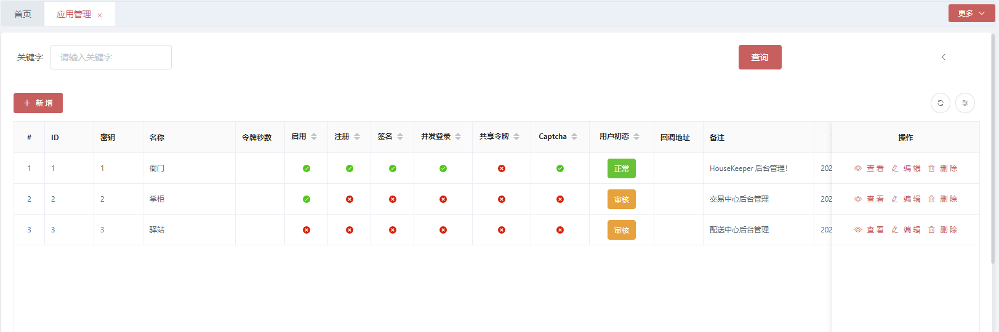
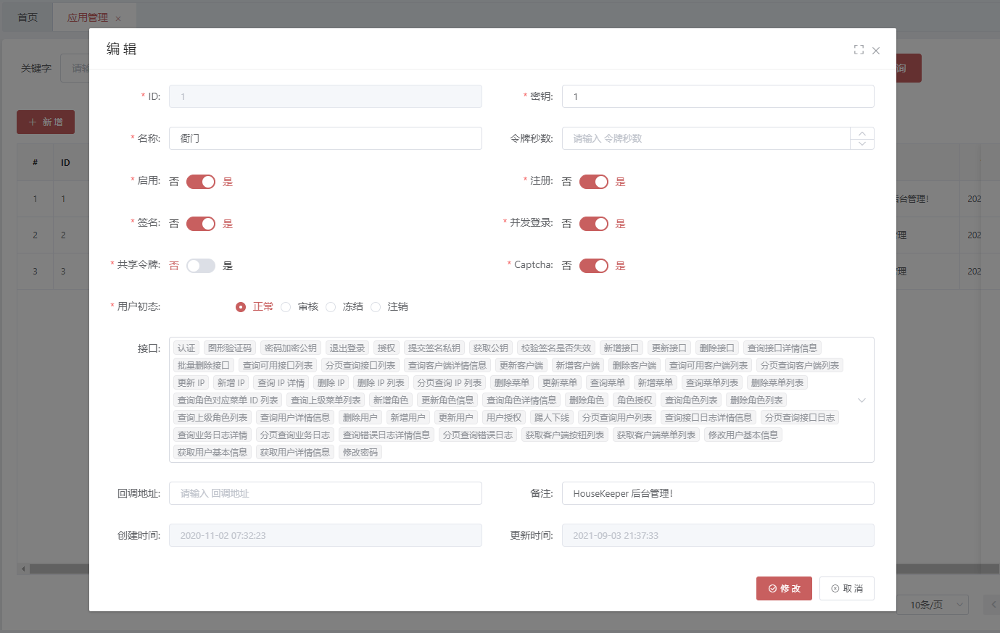

## 多客户端用户管理

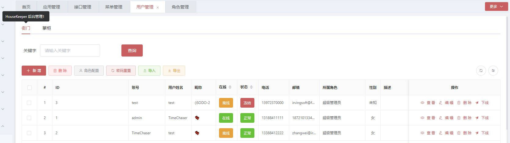
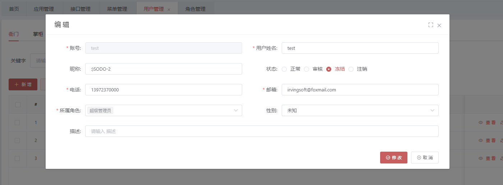
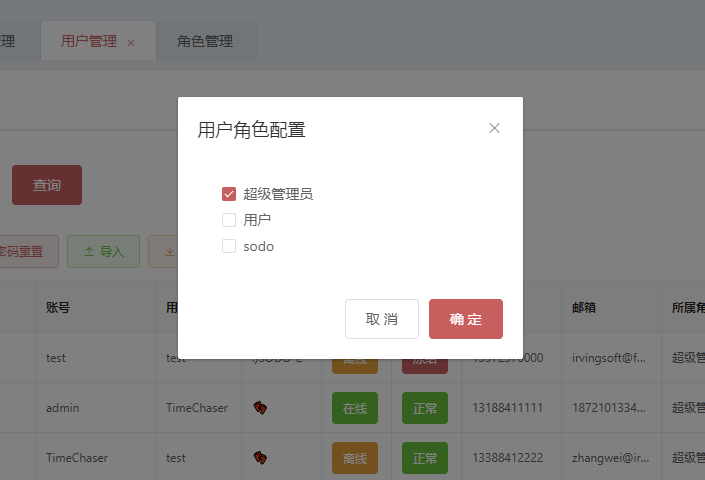
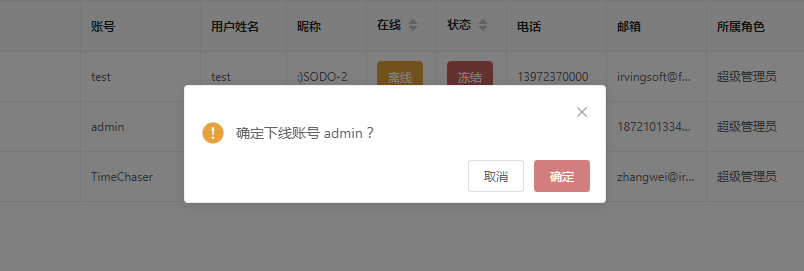

## 多客户端角色管理

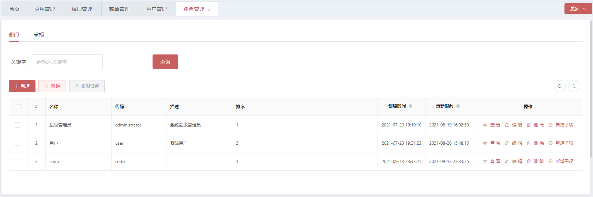
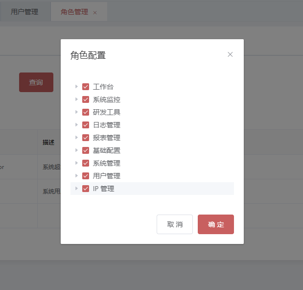

## 多客户端菜单管理

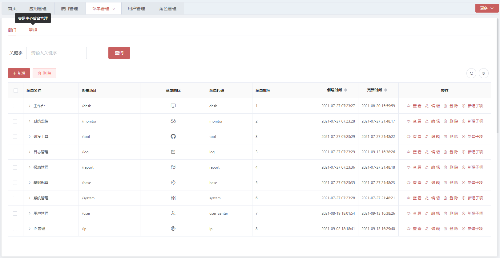
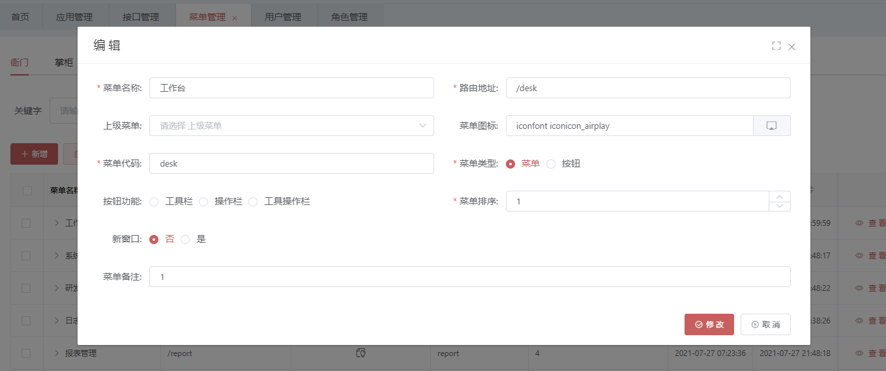

## 接口管理

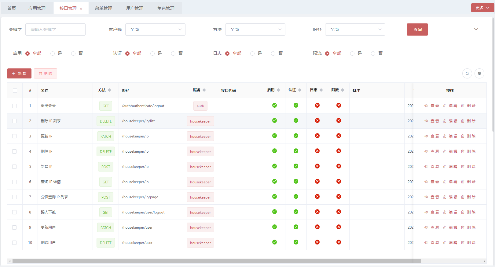
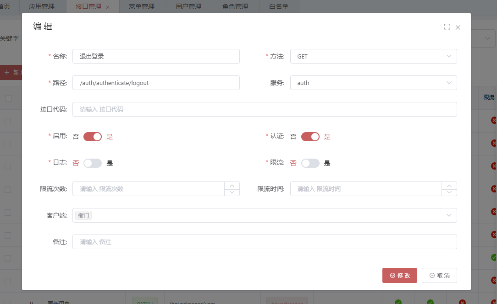
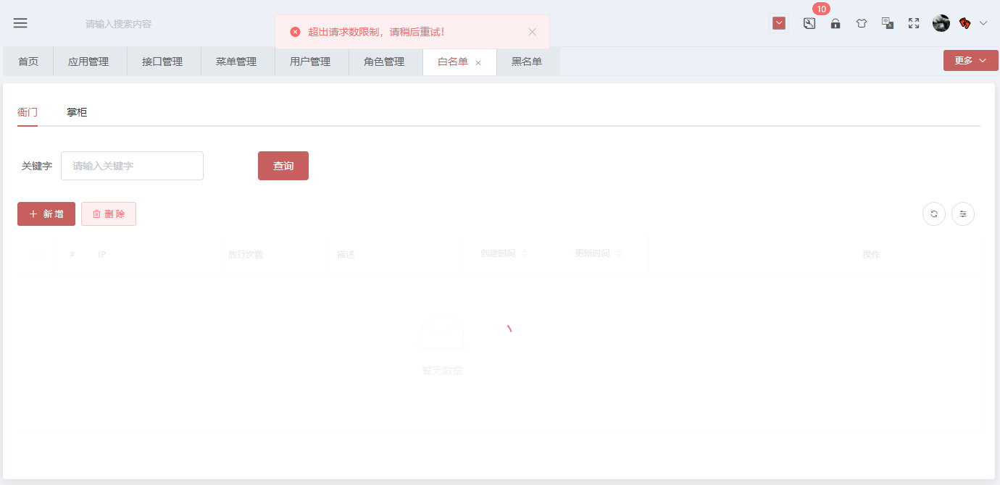

## 多客户端 IP 管理

## 分布式日志

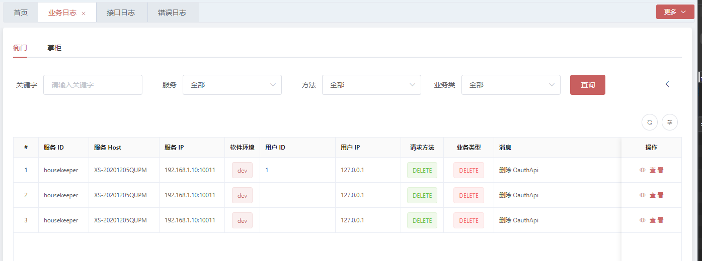
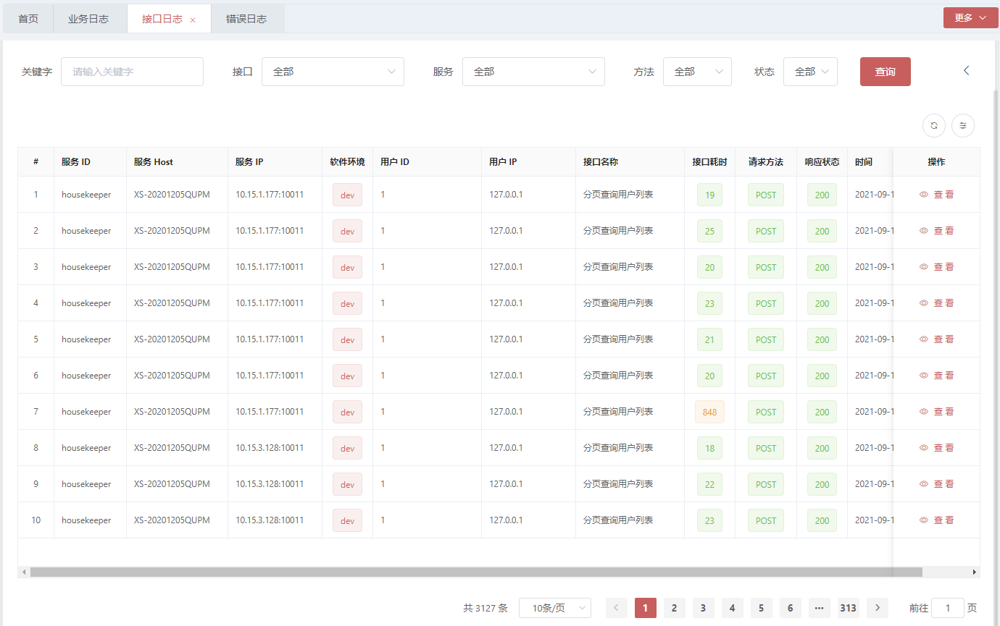
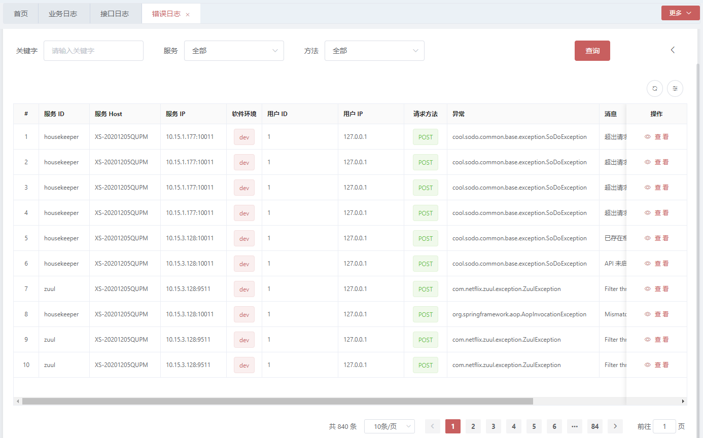

## 接口编写规范

* 推荐使用 URL 传参
* RESTFul 接口约定

  `Method`（资源操作行为，改变资源的状态）。

  `GET` ：请求服务器特定资源。

  `POST` ：服务器创建一个新资源。

  `PUT` ：更新服务器资源客（整个资源）。

  `DELETE` ：服务器删除特定资源。

  `PATCH` ：更新服务器上的资源（资源的部分）。

## Swagger2 接口文档地址

localhost:9511/doc.html
