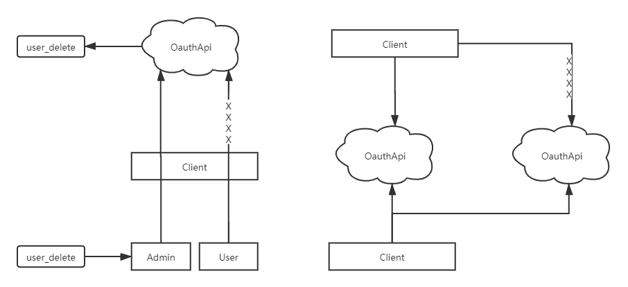

# sodo-platform

**IBAC（Interface-Based Access Control，基于接口的权限控制）微服务快速开发平台。**

由于原仓库错误的合并操作，故清空后重新提交了代码。

## 平台架构

## 基于接口的权限控制（IBAC）

基于接口的权限控制从两个方面进行权限控制：

1. 控制接口所属客户端，没有加入接口对应的客户端列表的客户端无法请求该接口。
2. 在基于角色的权限控制基础上，将权限细化到每个接口。当请求的接口存在权限标识时，查询用户对应角色拥有的权限，并进行权限匹配。

## 分布式日志

## 接口编写规范

* 推荐使用 URL 传参

## 项目启动流程

* 本地新建数据库 sodo-platform
* 在数据库工具中运行 sodo_platform.sql
* 修改 application-dev.yml 下的数据库配置，切换为自己的数据库账号密码
* 启动 redis
* 启动 rabbitMQ
* 依次启动 eureka、zuul、auth 等其他项目

## 技术点

* 统一接口返回数据
* 统一响应码
* 全局异常处理
* Redis 中间件
* RabbitMQ 异步消息队列
* Swagger2 接口文档
* 服务监控

## RESTFul 接口约定

    Method（资源操作行为，改变资源的状态）。
    
    GET ：请求服务器特定资源。
    
    POST ：服务器创建一个新资源。
    
    PUT ：更新服务器资源客（整个资源）。
    
    DELETE ：服务器删除特定资源。
    
    PATCH ：更新服务器上的资源（资源的部分）。

## Swagger2 接口文档地址

localhost:9511/doc.html

## 业务架构

