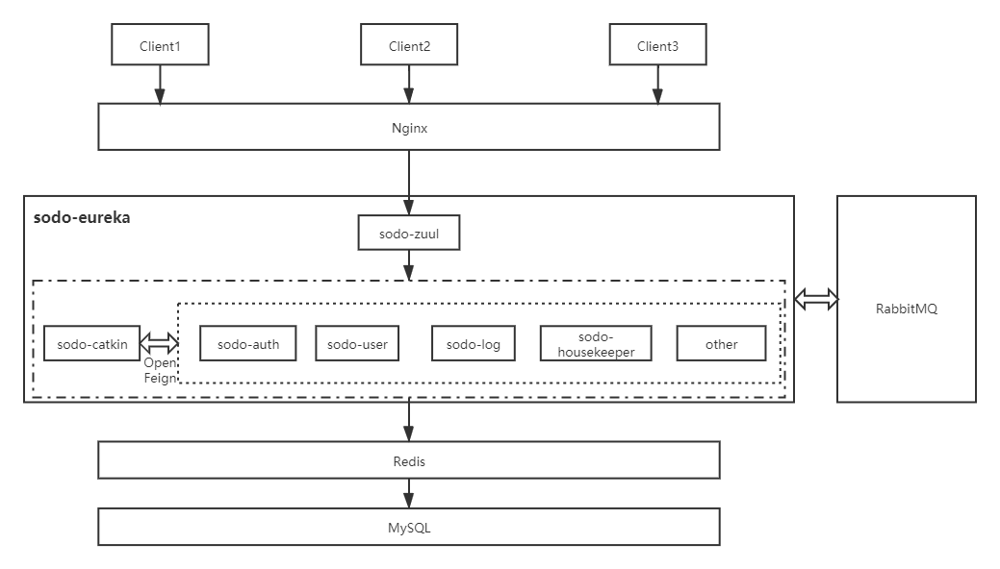

# sodo-platform

**IBAC（Interface-Based Access Control，基于接口的权限控制）微服务快速开发平台。**

由于原仓库错误的合并操作，故清空后重新提交了代码。

## 平台架构

## 编码思想

1. 永远不相信来自客户端的任何输入

## 接口编写规范

1. 新增接口，如果 ID 不为空则查询是否存在 ID 对应的记录，存在则报错
2. 更新接口，ID 为空报错，如果必要，根据业务验证是否是本人。
3. 删除接口，由于是 RESTFul 风格传参，所以 ID 不会为空，判断是否存在 ID 对应的记录，不存在则报错
4. Service 层，增、删、改方法抛出 `ResultEnum.SERVER_ERROR` 异常，查方法抛出 `ResultEnum.BAD_REQUEST` 异常

## 开发规划

1. 基于 Vue 的，与 SODO-Housekeeper 配套的管家服务后台前端
2. sodo-logger

## 项目启动流程

* 本地新建数据库 sodo-platform
* 在数据库工具中运行 sodo_platform.sql
* 修改 application-dev.yml 下的数据库配置，切换为自己的数据库账号密码
* 启动 redis
* 启动 rabbitMQ
* 依次启动 eureka、zuul、auth 等其他项目

## 技术点

* 统一接口返回数据
* 统一响应码
* 全局异常处理
* Redis 中间件
* RabbitMQ 异步消息队列
* Swagger2 接口文档
* 服务监控

## RESTFul 接口约定

    Method（资源操作行为，改变资源的状态）。
    
    GET ：请求服务器特定资源。
    
    POST ：服务器创建一个新资源。
    
    PUT ：更新服务器资源客（整个资源）。
    
    DELETE ：服务器删除特定资源。
    
    PATCH ：更新服务器上的资源（资源的部分）。

## Swagger2 接口文档地址

localhost:9511/doc.html

## 统一缓存处理

* 每个实体类对应的 Service 层都做缓存处理，除了本实体类的增删改查基本的缓存处理，还有与其父对象、子对象的联动缓存处理

* 将 存 操作分级细化到每个具体业务的查询上

* 将 Evict 操作覆盖到对应的具体业务的每一个子对象的变更上

* 一期工程主要构件 客户端业务 的全对象缓存处理

## 问题

* 在此架构方式下，**CI/CD 时，如何精确定位到要重启的服务**
* 如何结合 docker 部署线上环境，引入 docker 配置文件
* 服务监控与治理
* 数据库连接时区设为 Asia/Shanghai，若请求出的时间时区有误，则通过 JSON 转换

